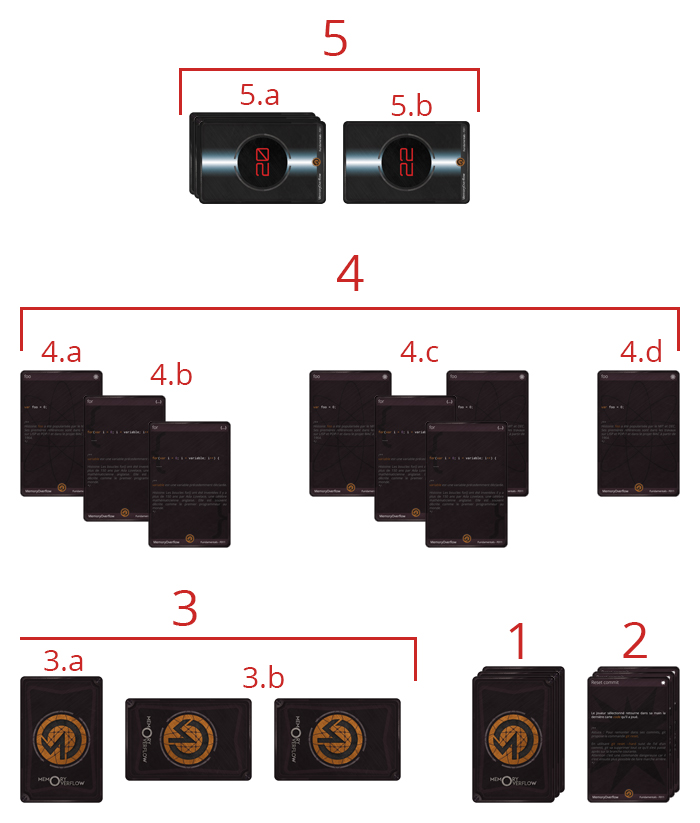

# MemoryOverflow - Les règles du jeu

1. [Introduction](#introduction)
2. [Prérequis](#requirements)
3. [Comment se déroule une partie](#game)
  1. [Le plateau de jeu](#plateau)
  2. [Débuter une partie](#debut)
4. [Les 3 types de cartes](#types)

## Introduction

MemoryOverflow stratégique dans lequel 2 joueurs s'affrontent pour le contrôle de La Machine avec des cartes. Le jeu se déroule en tour par tour où chaque adversaire place des cartes sur la table pour créer un algorythme dont le but est de percer le code de La Machine et ainsi gagner la partie.

Le succès d'une partie se determine dans la stratégie mais surtout dans la créativité de programmation des joueurs. En alliant plusieurs cartes il est possible de créer de parfaits combos dont la puissance peut faire changer le cours d'une partie et détruire son adversaire sans effort. Plus un joueur est bon développeur, plus il a de chances de remporter la victoire.

## Prérequis

Pour jouer à MemoryOverflow il faut que chaque joueur dispose d'un set de cartes ainsi qu'un set suplémentaire de cartes _The Machine_ que l'un ou l'autre peut apporter.

Toutes ces cartes sont disponibles **gratuitement** sur le [site officiel](http://memoryoverflow.codecorico.com) et peuvent être imprimées en suivant l'aide disponible sur la page d'impression.

:heavy_exclamation_mark: Attention, chaque carte utilisée dans un set doit être dans sa dernière version. En cas de doute, il suffit d'inscrire dans le champs de recherche du site l'identifiant de la carte (trouvé dans son coin inférieur droit) pour vérifier qu'elle n'est pas obselette.

## Comment se déroule une partie

Avant de commencer une partie, chaque joueur doit disposer d'un set composé d'au minimum 60 cartes et maximum 70 qui composera son jeu. On appelle ce set _[La Noosphère](http://fr.wikipedia.org/wiki/Noosph%C3%A8re)_ en hommage aux idées qui nous arrivent lorsque l'on code sans savoir exactement d'où elles viennent. Pour contruire une Noosphère il faut choisir parmis les [3 types de cartes](#types) communes. Hormis pour les cartes _[Variable](#variable)_ il n'est pas permis de prendre plus de 2 fois la même carte, sauf bien sur si la carte en question indique le contraire. Il est conseillé de mettre au moins 20% de cartes _Variable_ pour être certain d'en piocher suffisemment rapidement et ne pas bloquer son jeu dés le départ.

Une fois que vous avez votre Noosphère il vous faut créer un set de 10 cartes _La Machine_ déja définies par le jeu, à savoir :
- 3 cartes de valeur _18_
- 3 cartes de valeur _19_
- 3 cartes de valeur _20_
- 1 carte de valeur _22_

Ces cartes constituent le set appellé _La Machine_.

### Le plateau de jeu

  

### Débuter une partie

### Le premier tour

tours, manches, points

### Le Memory Overflow

## Les 3 types de cartes

Les versions des cartes et la vérification sur le site web

### La variable

### Le code

### L'évènement

  

